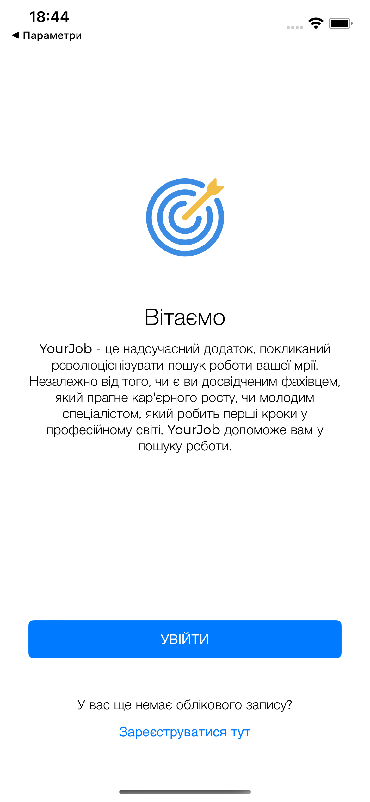
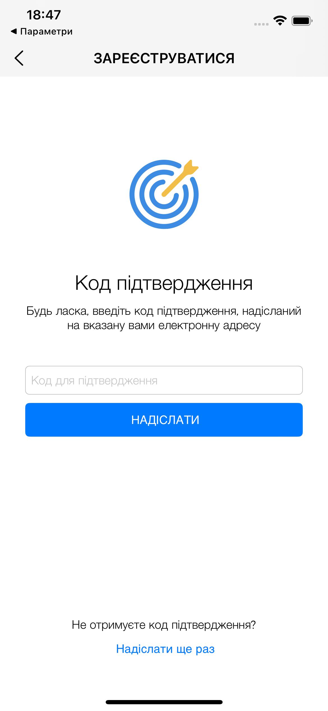
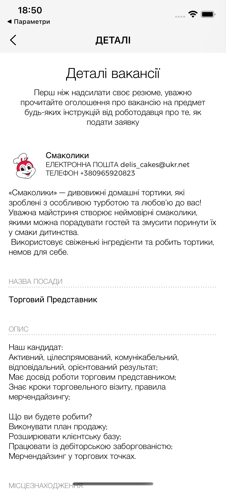

## YourJob — mobile iOS app for job search

It's a mobile application training project that helps you quickly find vacancies based on specified criteria. The application is implemented for iOS with an emphasis on modern architecture, AWS cloud services, and a user-friendly interface.

### Features

- **Registration and authorization** via Amazon Cognito
- **Search and filter jobs** by category, job title, location, distance, and salary
- **View job details** and employer information
- **Save search filter** between sessions
- **Dark/light theme** and responsive interfaces for iPhone/iPad

### Architecture and Design

- **Client-side (iOS, Swift)**: MVC pattern, responsive UI, theme support.
- **Backend (Serverless on AWS)**: GraphQL API via **AWS AppSync**, data in **Amazon DynamoDB**.
- **Authentication**: **Amazon Cognito (User Pool)**.
- **Analytics and stability**: **Firebase Analytics**, **Firebase Crashlytics**.
- **Caching and offline access (partially)**: local AWS AppSync cache + custom image caches.

### Technology Stack

- iOS 15+, Swift, Xcode, UIKit
- CocoaPods: `AWSAppSync`, `AWSCognitoIdentityProvider`, `Firebase/Analytics`, `Firebase/Crashlytics`
- AWS: Cognito, AppSync (GraphQL), DynamoDB, CloudWatch
- Tools: Node.js, AWS CLI, Amplify CLI

### Install and Run (Locally)

- Make sure you have the required tools installed: Xcode, CocoaPods, Node.js, and Amplify CLI.
- Install iOS dependencies via CocoaPods and open the project in `.xcworkspace`.
- Run the app in Xcode on a simulator or physical device.

### Screenshots

  
  
  
  

  
  
  
  

  
  
  
  

